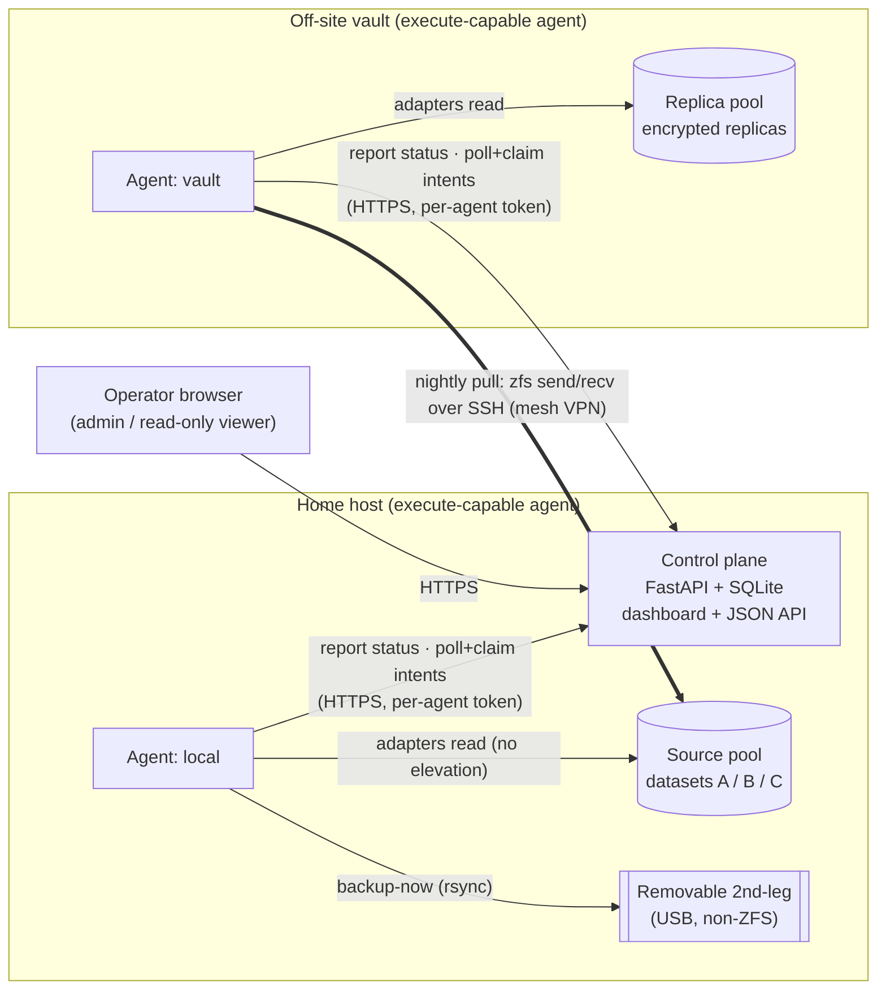
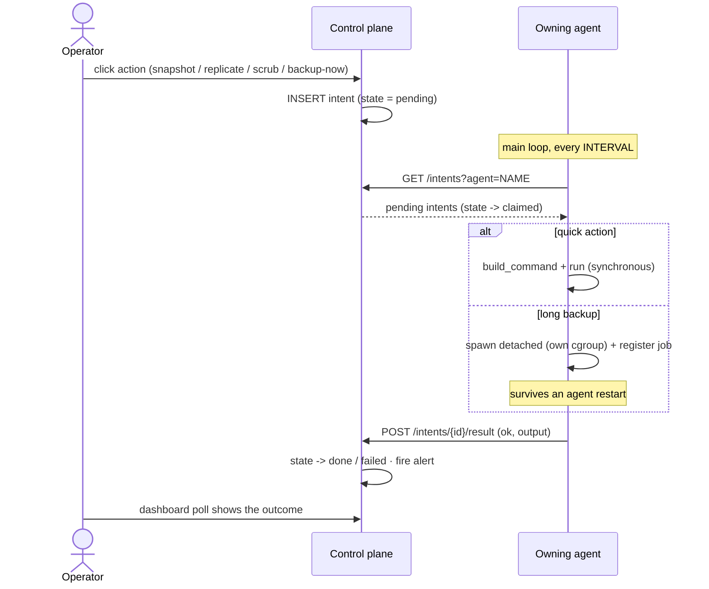
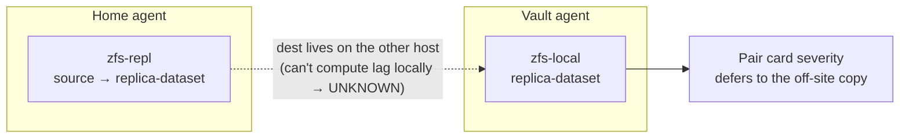

# Cairn architecture

How the pieces fit together: a small **control plane** that stores state and renders the
dashboard, and one or more **uniform agents** that report health and execute on-demand actions.
Agents never receive an inbound connection - they **poll** the control plane over HTTPS with a
per-agent token, so there is no phone-home to a cloud and nothing to expose at a remote site.

- **Control plane** - a single FastAPI process + SQLite, serving the dashboard and a small JSON
  API. It owns all state (targets, status history, intents, tokens, links) and fires alerts.
- **Agent** - the same `agent.py` + `collector.py` on every host, in one of two modes:
  *report-only* or *execute-capable*. It discovers backup targets, reports their health each
  cycle, and (if execute-capable) claims and runs queued actions.
- **Adapters** - the collector's per-technology probes: ZFS (pool + replication), borg, restic,
  rclone, snapper, backupninja, SMART, and a removable 2nd-leg drive. Each returns a normalized
  status the control plane stores and scores.

## System topology

Both agents talk **only** to the control plane's HTTPS endpoint. The off-site pull is the one
agent-to-host data path, and it is initiated **outbound from the vault** (the vault SSHes to home
and runs `zfs send | recv`), so the vault needs no inbound ports and home's firewall stays closed.

## The intent / action queue

The dashboard never executes anything itself. An action becomes an **intent** row in SQLite; the
owning agent claims it on its next poll, runs it, and reports the result back. State lives entirely
in the control plane, so an agent can restart mid-flight without losing the work.

- **Routing** - each target names its owning `agent`; an agent only ever sees intents for the
  targets it owns.
- **Dry-run** - every action can run a native read-only probe (`-n` / list-only) instead of the
  mutating command, returning the *real* output of the probe.
- **Detached long jobs** - a real backup can run for hours. It is launched into its **own transient
  cgroup** (via `systemd-run --user`, falling back to `setsid`) so it neither blocks the agent's
  report/claim loop nor dies when the agent restarts. An on-disk job registry lets the agent *reap*
  the result (and report live progress: %, rate, ETA) on a later cycle.

## Authentication (zero-trust, hash-at-rest)

Every request carries a bearer token; only the **SHA-256 of each token** is stored, never the
token itself. There are three principals:

| Principal | Gets | Can |
| --- | --- | --- |
| **admin** | the bootstrap `CAIRN_ADMIN_TOKEN` (hashed at startup) | everything: views + queue actions + mint tokens |
| **viewer** | a password login / read-only token | see the dashboard; no actions |
| **agent** | a per-host token (or a one-time enrollment secret it trades for one) | report status, poll/claim intents, post results - nothing else |

Per-agent tokens are individual rows, so any one host can be revoked without touching the others.
A dedicated, single-purpose **CI token** may push pipeline status to one badge route and nothing
else, so it is safe to hand to CI.

## Adapters (what each agent monitors)

The collector normalizes every backup technology into the same status shape (severity + freshness
+ detail), so the dashboard scores them uniformly:

- **ZFS local** - pool health / capacity / scrub age / resilver + per-vdev errors; per-dataset
  snapshot freshness.
- **ZFS replication** - real replication lag = the age of the newest snapshot **common** to source
  and destination (not wall-clock), plus zero-knowledge awareness (flags a destination whose
  encryption key unexpectedly becomes available).
- **borg / restic / rclone / snapper / backupninja** - newest-archive freshness + counts, read
  without runtime elevation (group-readable repos; keys via env/keyfile references, never inline).
- **SMART** - per-disk health from `smartd`'s journal by default; an opt-in scoped `smartctl`
  wrapper adds the full attribute table. Removable/USB disks are excluded (covered by their own card).
- **Removable 2nd-leg** - see below.

## Replication pairing

When a dataset is replicated to another host, cairn sees **two** status rows with the same name -
the sending side (a `zfs-repl` target on home) and the receiving side (a `zfs-local` target on the
vault). It auto-merges them into one **pair card** when the sender's destination is exactly the
receiver's source.

The sending host can't measure replication lag once the destination lives on a different agent, so
its half reports **UNKNOWN** by design. The pair's severity therefore **defers to the off-site
copy** - the meaningful end-to-end 3-2-1 signal (it goes stale if the source stops snapshotting
*or* the pull stalls). The hero counters are pair-aware, so a merged pair is counted once, at its
off-site half.

## Removable 2nd-leg drive

An external drive is modeled as a `removable` target - the "2nd media" of 3-2-1. It is recognized
by a **stable id** (filesystem UUID / `by-id`), so its absence is a neutral *detached* state, never
an error. Datasets are **linked** to a subpath on the drive (namespaced `cairn/<host>/<slug>`), and
each link can independently:

- **census** its fit (dry-run rsync: what would be added, and whether it fits the free space),
- **verify** content (cached `user.b3sig` xattrs when the drive is tagged, else a full BLAKE3 hash),
- choose **additive** vs **mirror** (rsync `--delete`) per dataset,
- exclude top-level folders to fit a partial mirror.

A freshly-linked dataset (nothing on the drive yet) shows its size + fit + a first-sync prompt
rather than an empty diff, and flags a source that is unmounted or encrypted-and-locked.

## Off-site pull

The off-site replica is a **pull**, initiated by the vault, so nothing at the remote site is
exposed. A small runner reads a flat config of replication **sets** (`source-dataset ->
replica-dataset [raw]`) and runs `syncoid` over an SSH key restricted to a single forced command on
home. A nightly systemd `--user` timer pulls every set; the dashboard's **Replicate now** button
queues an intent that runs the same runner for one set on demand. Encrypted datasets are sent
**raw** (`zfs send -w`), so the vault stores ciphertext it cannot read. Hosts reach each other over
a mesh VPN by hostname, so the config survives the vault physically moving networks.

## CI status without public pipelines

The public README badge is served by cairn itself, not by the (private) CI provider. CI `POST`s its
pass/fail to the control plane using the scoped CI token; the control plane renders an SVG badge at
a public route for the one allowed badge name. Internal pipelines stay private while their status is
still visible on the public README.

---

*Generic names (home / vault, source / replica, datasets A/B/C) stand in for a real deployment. See
the [README](../README.md) for install and operation, and `AGENT.md` for the agent's own runbook.*
